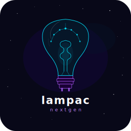

# Lampac NextGen — Дополнение для Home Assistant

[🇬🇧 English version](README.md)

[](https://github.com/BrainDeLook/lampac-ha/releases)
[](LICENSE)



Дополнение для Home Assistant на основе [Lampac NextGen](https://github.com/lampac-nextgen/lampac) — самохостируемый бэкенд для агрегации ссылок с 60+ VOD-провайдеров для плеера [Lampa](http://lampa.mx).

## Возможности

- 🎬 60+ VOD провайдеров: Rezka, Filmix, Kodik, Alloha, HDVB и многие другие
- 🗂️ Группы модулей с переключателями — включай только нужное
- 🔞 Контент 18+ отключён по умолчанию
- 🛠️ **AdminPanel** встроена — управляй конфигом через веб-интерфейс
- 🔄 Автообновления через GitHub Actions
- 💾 Сохранение данных между перезапусками

## Установка

### Установка в один клик

[](https://my.home-assistant.io/redirect/supervisor_add_addon_repository/?repository_url=https%3A%2F%2Fgithub.com%2FBrainDeLook%2Flampac-ha)

1. Нажми кнопку выше чтобы добавить репозиторий в Home Assistant
2. Перейди в **Настройки → Дополнения → Магазин дополнений**
3. Найди **Lampac NextGen** и нажми **Установить**
4. Настрой дополнение (см. раздел Конфигурация)
5. Нажми **Запустить**

### Ручная установка

1. Перейди в **Настройки → Дополнения → Магазин дополнений**
2. Нажми три точки (⋮) → **Репозитории**
3. Добавь: `https://github.com/BrainDeLook/lampac-ha`
4. Найди **Lampac NextGen** и установи

## Конфигурация

| Параметр | Описание | По умолчанию |
|----------|----------|--------------|
| `root_password` | Пароль для AdminPanel | `changeme` |
| `admin_panel_url` | Ссылка на AdminPanel (замени YOUR_HA_IP) | `http://YOUR_HA_IP:9118/adminpanel/auth` |
| `enable_admin_panel` | Включить модуль AdminPanel | `true` |
| `enable_stats` | Включить Stats в AdminPanel | `true` |
| `enable_russian_vod` | Русские VOD: Rezka, Filmix, Kodik, Alloha, HDVB и др. | `true` |
| `enable_anime` | Аниме источники | `true` |
| `enable_adult` | Контент 18+ | `false` |
| `enable_torrserver` | Интеграция с TorrServer | `true` |
| `enable_jacred` | JacRed торрент-индексатор | `true` |
| `enable_torrent_other` | Прочие торрент источники | `true` |
| `enable_foreign` | Зарубежные источники (VidSrc, AutoEmbed и др.) | `true` |
| `enable_ukraine` | Украинские источники | `true` |

## AdminPanel

После запуска дополнения открой AdminPanel по адресу:
```
http://YOUR_HA_IP:9118/adminpanel/auth
```
Используй `root_password` из Конфигурации для входа.

## Подключение к Lampa

Добавь Lampac как источник в настройках Lampa:
```
http://YOUR_HA_IP:9118
```

## Благодарности

- [Lampac NextGen](https://github.com/lampac-nextgen/lampac) — оригинальный проект

## Лицензия

MIT
